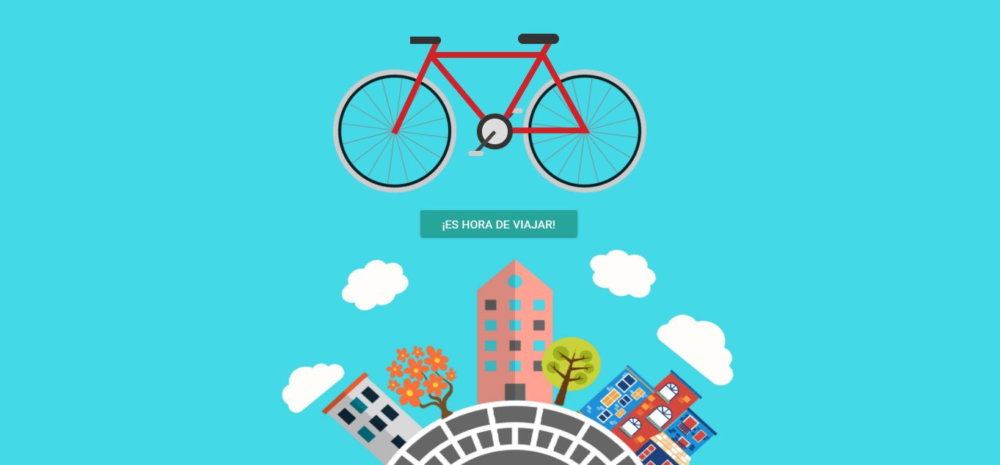
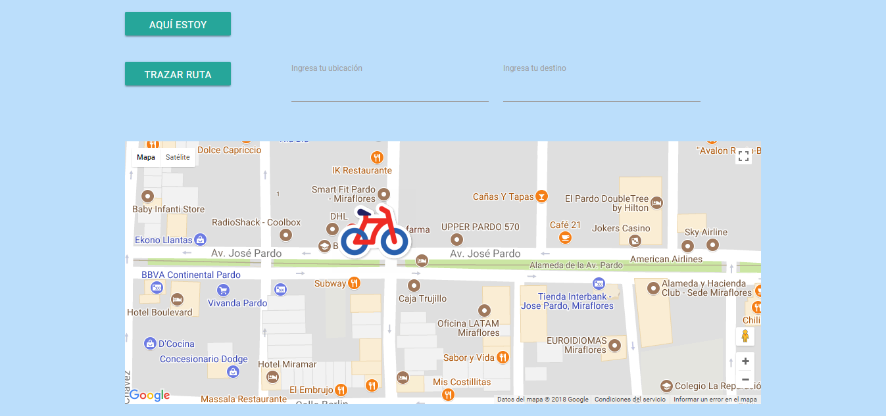

# EASY-VRECO

  EASY-VRECO es un reto asignado por Laboratoria, donde debemos de usar nuestros conocimientos adquiridos sobre el API de geolocalización de html5 y googlemaps,
  Se debera hacer una pagina web que hara que encuentres tu localización exacta, además de poder trazar una ruta entre un punto d epartida hacia el punto de destino, usando tambien la libreria de goole autocomplete places.

  

  

***
## RECURSOS

__Html5__

Lenguaje de marcas de hipertexto utilizado para ordenar la estructura de nuestra pagina web.

__Css3__

Hojas de estilo en cascada usado para el diseño visual de nuestra pagina web.

__Materialize__

Framework usado para ayudar en la estructura de nuestra pagina web y ser mobile friendly (Responsive).

__jQuery__

Biblioteca multiplataforma de JavaScript que simplifica la manera de interactuar con los doumentos html de nuetsro repositorio.

__Babel__

Compilador que nos permite transformar nuestro código JS de última generación a un JS que cualquier navegador o versión de Node.js entienda.

__Node.js__

Entorno de ejecución multiplataforma de código abierto que ayudara a nuestra pagina a ser altamente escalable.

__Gitignore__

Herramienta brindado por Git para ignorar node_modules u otras carpetas que no deban incluirse en control de versiones (git).

__Google Maps__

API de google que te permitira usar y manejar el mapa de google.

__Google Places__

API de google que te ayudar a que los inputs tengan autocompletdao de los lugares del mapa de google.

***
## Integrantes

  Ani Fiorella

  Melissa Nataly